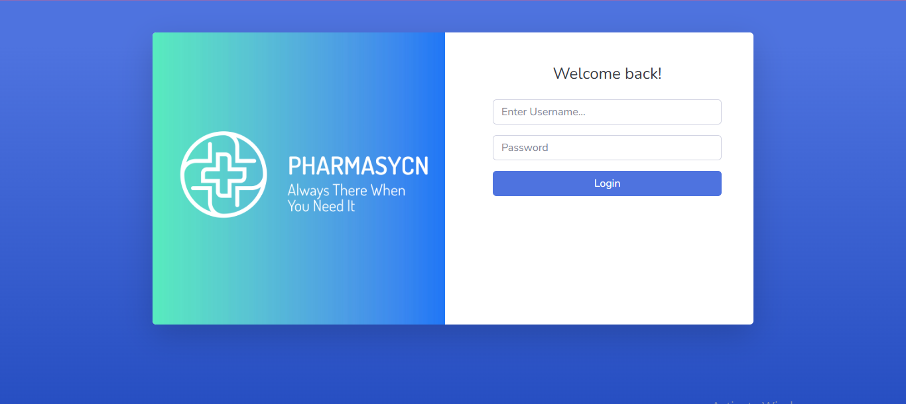
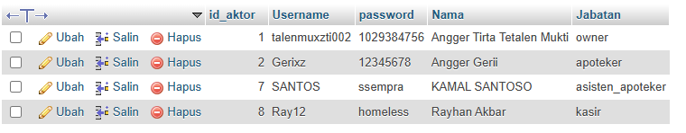
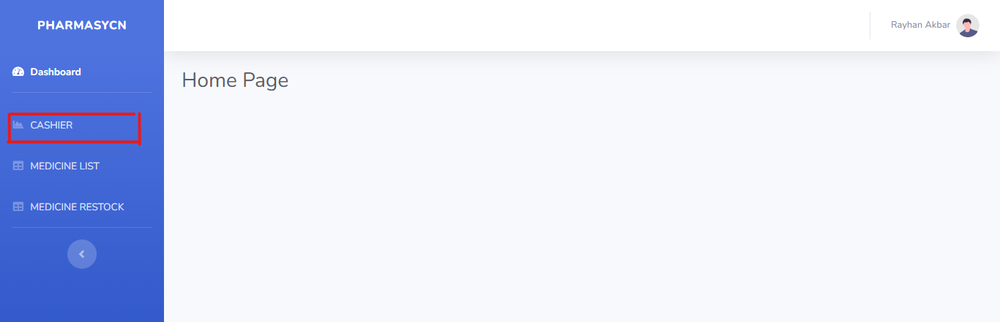
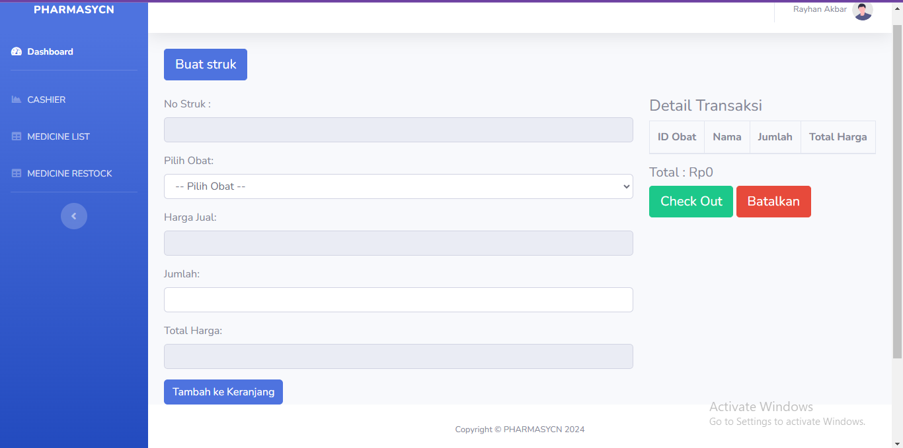

# **Tugas Akhir Pemrograman Web Dinamis**  
## **Kelompok 135 & 377**  
### **Dosen Pengampu: Supriyanto ST, MT**

---

## **Anggota**  
- **Angger Tirta Tetalen Mukti** (2200018135)  
- **Rayhan Akbar Hidayat** (2200018377)  

---

## **Deskripsi Proyek**  
Tugas ini dibangun menggunakan **PHP Native** dan didukung dengan framework **Bootstrap** untuk tampilan antarmuka yang responsif dan modern.

### **1. Login Page**  

#### **Data Pengguna**  

#### **Status Role**  
- Jika memasukkan akun dengan **status Kasir**, maka akan masuk ke halaman **Kasir**.  
- Jika memasukkan akun dengan **status Owner**, maka akan masuk ke halaman **Owner**.  

---

### **2. Kasir Dashboard Page**  
  

#### **Halaman Kasir**  

- Untuk membuat sebuah nota/struk, klik tombol **"BUAT STRUK"** di halaman kasir.  
- Untuk menambahkan item, cari item obat yang diinginkan, lalu tambahkan ke **keranjang**.  
- Jika item transaksi sudah sesuai dengan keinginan customer, klik tombol **"Checkout"** untuk mencetak struk.  
- Jika item tidak sesuai dengan keinginan customer, dapat dibatalkan dengan klik tombol **"Batalkan"**.  

---

## **Petunjuk Instalasi**  
Ikuti langkah-langkah berikut untuk menjalankan aplikasi ini di lingkungan lokal Anda:  

1. **Salin Repository**  
   - Clone atau unduh repository ini ke komputer Anda.  

2. **Impor Database**  
   - Buka aplikasi **phpMyAdmin** atau alat pengelola MySQL lainnya.  
   - Import file database yang terdapat di folder `database` ke dalam MySQL lokal Anda.  

3. **Jalankan di Server Lokal**  
   - Pastikan server lokal (seperti **XAMPP** atau **Laragon**) telah berjalan.  
   - Tempatkan folder proyek di direktori server lokal, misalnya di `htdocs` untuk XAMPP.  
   - Akses proyek melalui browser dengan URL: `http://localhost/[nama-folder-proyek]`.  

---

## **Catatan Penting**  
- Pastikan **PHP** dan **MySQL** telah terinstal di komputer Anda.  
- Gunakan versi browser terbaru untuk memastikan antarmuka ditampilkan dengan benar.  

---

Semoga sukses dalam menyelesaikan proyek ini! 🚀
